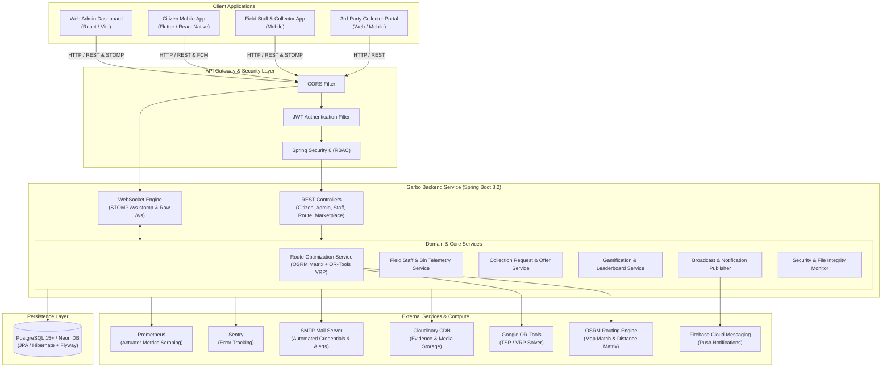
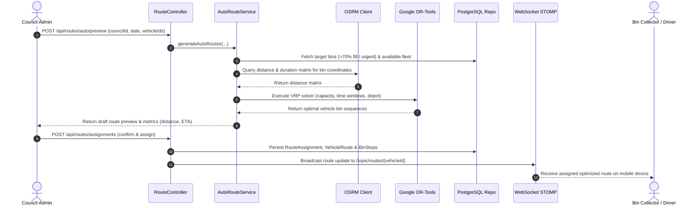
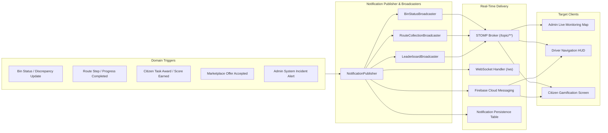

# Garbo Backend (`Garbo_backend`)

[](https://www.oracle.com/java/)
[](https://spring.io/projects/spring-boot)
[](https://www.postgresql.org/)
[](https://www.docker.com/)
[](https://aws.amazon.com/)
[](https://spring.io/guides/gs/messaging-stomp-websocket/)
[](https://developers.google.com/optimization)

> **Garbo** is an enterprise-grade, cloud-native backend powering the next-generation **Smart Municipal Solid Waste Management & Resource Recovery Ecosystem**. It orchestrates multi-council municipal governance, algorithmic route optimization, citizen gamification, real-time IoT bin telemetry, and specialized third-party recycling marketplaces.

---

## Table of Contents
- [1. Problem Domain & Value Proposition](#1-problem-domain--value-proposition)
- [2. System Architecture](#2-system-architecture)
  - [High-Level Architecture](#high-level-architecture)
  - [Automated Route Optimization Flow](#automated-route-optimization-flow)
  - [Real-Time Telemetry & Notification Engine](#real-time-telemetry--notification-engine)
- [3. Key Feature Modules](#3-key-feature-modules)
- [4. Technology Stack](#4-technology-stack)
- [5. Project Directory Structure](#5-project-directory-structure)
- [6. Database Architecture & Migrations](#6-database-architecture--migrations)
- [7. API & Real-Time Endpoints](#7-api--real-time-endpoints)
- [8. Security, Auditing & Integrity](#8-security-auditing--integrity)
- [9. Getting Started](#9-getting-started)
- [10. Testing & Quality Assurance](#10-testing--quality-assurance)
- [11. CI/CD & Cloud Deployment](#11-cicd--cloud-deployment)

---

## 1. Problem Domain & Value Proposition

Traditional municipal solid waste management suffers from critical operational bottlenecks:
* **Static, Inefficient Collection Schedules**: Waste trucks follow static schedules regardless of actual bin fill levels, leading to high fuel consumption, increased carbon emissions, and uncollected overflowing bins.
* **Citizen-Authority Disconnect**: Citizens lack transparent channels to report illegal dumping, overflow, or request bulky waste pickups, and lack incentives to participate in recycling.
* **Absence of Real-Time Fleet & Bin Telemetry**: Municipal managers lack live visibility into driver routes, bin status discrepancies, and field mentor verification.
* **Fragmented Private Recycler Market**: Specialized recyclers (e-waste, hazardous, industrial, commercial scrap) operate without a unified marketplace to connect directly with bulk generators.

### The Garbo Solution
**Garbo Backend** acts as the central nervous system connecting citizens, field staff, municipal administrators, and private recycling operators:
1. **Dynamic Algorithmic Routing**: Utilizes **Open Source Routing Machine (OSRM)** and **Google OR-Tools** to calculate dynamic, capacity-constrained Vehicle Routing Problems (VRP/TSP) that minimize travel distance and fuel consumption based on live bin fill priorities.
2. **Citizen Gamification & Community Incentives**: Reward points, tiered gamification tasks, and public leaderboards encourage proactive recycling and verified reporting.
3. **Multi-Council Data Governance**: Strict multi-tenant isolation ensures council administrators manage only their designated jurisdiction, while super-administrators maintain cross-council oversight.
4. **End-to-End Specialized Marketplace**: An integrated bidding and dispatch workflow for specialized e-waste, hazardous, and commercial waste collection requests.

---

## 2. System Architecture

### High-Level Architecture



---

### Automated Route Optimization Flow



---

### Real-Time Telemetry & Notification Engine



---

## 3. Key Feature Modules

### 1. Multi-Council Governance & Multi-Tenancy
* **Role Hierarchy**: `SUPERADMIN`, `ADMIN` (Council-scoped), `FIELD_MENTOR`, `BIN_COLLECTOR`, `CITIZEN`, `THIRD_PARTY_COLLECTOR`.
* **Council Scoping**: Automatic payload and repository filtering ensuring council administrators operate strictly within their municipality boundaries.
* **Superadmin Governance**: Global council boundary management, council creation, cross-council analytics, and staff assignment.

### 2. Dynamic Route Optimization & Fleet Dispatch
* **Algorithmic Vehicle Routing**: Integrates Google OR-Tools to solve Capacitated Vehicle Routing Problems (CVRP) with depot returns.
* **Real-Road Distance Matrices**: Fetches actual road network travel times and geometry using OSRM.
* **Live Route Sessions**: Tracks active driver collection sessions, bin stop completions, skipped bins with reasons, and remaining capacity in real-time.

### 3. Citizen Engagement, Reporting & Gamification
* **Incident & Complaint Reporting**: Photo upload with Cloudinary CDN integration, GPS coordinates, and status lifecycle (`PENDING` -> `ASSIGNED` -> `RESOLVED` -> `REJECTED`).
* **Bin Location Suggestions**: Crowdsourced bin placement suggestions with community upvoting.
* **Gamification Engine**: Configurable task families, automatic score awards upon verified green actions, and real-time council leaderboard ranking.

### 4. Field Mentors & Bin Telemetry Auditing
* **Bin Fill Level Telemetry**: Mentors report fill percentages, damage status, overflowing flags, and QR/RFID scan verification.
* **Discrepancy Detection**: Automated anomaly detection comparing predicted sensor levels vs mentor physical audits.
* **Duty Status Management**: Live duty toggles and location tracking for field mentors and collection laborers.

### 5. Third-Party Specialized Recycler Marketplace
* **Specialized Collection Requests**: Citizens and commercial entities post requests for e-waste, scrap metal, organic bulk, or hazardous materials.
* **Bidding & Offer Management**: Licensed 3rd-party collectors submit competitive quotes/offers.
* **State Machine Lifecycle**: Strict transitions (`OPEN` -> `PENDING` -> `ACCEPTED` -> `IN_PROGRESS` -> `COMPLETED` -> `CONFIRMED`) with auto-rejection of competing offers upon acceptance.

---

## 4. Technology Stack

| Layer / Category | Technology | Description |
|---|---|---|
| **Language & Runtime** | Java 17 / Java 21 | Modern LTS Java runtime environment |
| **Framework** | Spring Boot `3.2.0` | Core application framework |
| **Security** | Spring Security 6 + JWT | Stateless Bearer token authentication & RBAC |
| **ORM & Persistence** | Spring Data JPA / Hibernate | Object-Relational Mapping & repository layer |
| **Database** | PostgreSQL 15+ (Neon DB) | Serverless relational cloud database |
| **Database Migrations** | Flyway (`9.x` / `10.x`) | Automated versioned SQL schema migrations |
| **Optimization Algorithms** | Google OR-Tools | Operations Research suite for VRP / TSP solvers |
| **GIS & Routing** | OSRM (Open Source Routing Machine) | High-performance road distance matrix calculation |
| **Real-Time Communication** | Spring WebSocket (STOMP + SockJS) | Pub/Sub bi-directional messaging (`/ws-stomp`, `/ws`) |
| **Push Notifications** | Firebase Cloud Messaging (FCM) | Cross-platform mobile notifications |
| **Media & Asset CDN** | Cloudinary API | Cloud image uploads, transformations & storage |
| **Email Service** | JavaMailSender (SMTP / Gmail) | Automated credential provisioning & alert emails |
| **Observability & Metrics** | Sentry SDK & Micrometer Prometheus | Real-time crash analytics and Prometheus metrics |
| **Containerization & CI/CD** | Docker, GitHub Actions, AWS SSM | Multi-stage Docker builds & automated deployment |

---

## 5. Project Directory Structure

```text
Garbo_backend/
├── .github/
│   └── workflows/
│       ├── ci.yml                    # Automated build, test gate & Trivy security scanner
│       └── cd.yml                    # AWS EC2 container deployment via ECR & SSM
├── scripts/
│   ├── debug_route_local.sh          # Local route optimization testing script
│   └── debug_route_production.sh     # Production endpoint diagnostic script
├── src/
│   ├── main/
│   │   ├── java/com/garbo/
│   │   │   ├── Main.java             # Spring Boot main application entrypoint
│   │   │   ├── api/                  # Web / REST Layer
│   │   │   │   ├── controller/       # REST Endpoints (Citizen, Staff, Route, Admin, etc.)
│   │   │   │   ├── dto/              # API Request & Response Data Transfer Objects
│   │   │   │   ├── exception/        # GlobalExceptionHandler and custom exceptions
│   │   │   │   ├── mapper/           # Entity to DTO mappers
│   │   │   │   └── websocket/        # Raw WebSocket handlers
│   │   │   ├── common/               # Shared Utilities & Cross-Cutting Config
│   │   │   │   ├── config/           # CORS & application-wide beans
│   │   │   │   └── logging/          # Diagnostic logging utilities
│   │   │   ├── core/                 # Business Logic & Domain Core
│   │   │   │   ├── entity/           # JPA Entities (User, Bin, Route, Complaint, etc.)
│   │   │   │   ├── enums/            # Domain Enums (Role, Status, WasteType, etc.)
│   │   │   │   ├── repository/       # Spring Data Repositories & Native Queries
│   │   │   │   └── service/          # Business Services (Route, Citizen, Notification, etc.)
│   │   │   ├── domain/               # Algorithmic & Mathematical Models
│   │   │   │   ├── ORToolsWrapper.java # Google OR-Tools VRP Solver Integration
│   │   │   │   └── OSRMClient.java     # OSRM Distance Matrix HTTP Client
│   │   │   └── infrastructure/       # External Systems & Platform Adapters
│   │   │       ├── config/           # Security, WebSocket STOMP, DataSeeder, Schedulers
│   │   │       ├── email/            # JavaMailSender Email Service & HTML Templates
│   │   │       ├── push/             # Firebase Cloud Messaging Service (FCM)
│   │   │       ├── storage/          # Cloudinary Media Upload Adapter
│   │   │       └── websocket/        # STOMP Broadcasters & Session Managers
│   │   └── resources/
│   │       ├── application.yml       # Base configuration
│   │       ├── application-local.yml # Local developer profile (reads .env)
│   │       ├── application-prod.yml  # Production AWS profile
│   │       └── db/migration/         # Versioned Flyway SQL Migrations (V1 to V9)
│   └── test/
│       ├── java/com/garbo/
│       │   ├── api/controller/       # Controller slice tests (@WebMvcTest)
│       │   ├── core/service/         # Isolated Unit Tests (Mockito)
│       │   ├── flow/                 # End-to-end multi-step flow tests (@SpringBootTest)
│       │   └── repository/           # Database integration tests (Testcontainers)
│       └── resources/
│           └── application-test.yml  # In-memory H2 PostgreSQL mode test profile
├── Dockerfile                        # Multi-stage optimized production Docker build
├── pom.xml                           # Maven dependencies and build configuration
└── README.md                         # Project documentation
```

---

## 6. Database Architecture & Migrations

The database is managed with **Flyway** migration scripts located under `src/main/resources/db/migration/`:

| Migration | Scope / Description |
|---|---|
| `V1__create_collection_request_module.sql` | Base schema for specialized collection requests and offers |
| `V2__add_collector_hidden_to_offers.sql` | Collector offer visibility and soft-deletion flags |
| `V3__add_admin_hidden_to_external_users.sql` | Admin moderation and soft-delete capabilities for external entities |
| `V3_1__collection_request_waste_types.sql` | Multi-category waste taxonomy enumeration |
| `V4__add_admin_hidden_to_internal_users.sql` | Staff archival and council isolation controls |
| `V5__bin_report_discrepancy_columns.sql` | Audit columns for physical vs reported bin discrepancy detection |
| `V6__bin_suggestions.sql` | Citizen crowdsourced bin suggestion schema with geolocation |
| `V7__notifications.sql` | Persistent in-app notification records and recipient mappings |
| `V8__monthly_reports_council.sql` | Council-aggregated performance and collection analytics snapshot |
| `V9__make_email_unique.sql` | Case-insensitive lowercased unique constraint on `users(email)` |

---

## 7. API & Real-Time Endpoints

### Authentication & Accounts
* `POST /api/auth/login` — Authenticate and receive JWT Bearer token + role context.
* `POST /api/auth/register/citizen` — Self-service citizen registration.
* `POST /api/auth/change-password` — Mandatory password update on first staff login.
* `POST /api/auth/forgot-password` & `POST /api/auth/reset-password` — OTP-driven password recovery.

### Route Optimization & Fleet Management
* `POST /api/routes/auto/preview` — Generate algorithmic preview of collection routes using OR-Tools & OSRM.
* `POST /api/routes/assignments` — Finalize and dispatch route assignments to drivers.
* `GET /api/routes/vehicle/{vehicleId}` — Get active vehicle route details and ordered bin sequence.
* `POST /api/route-sessions/start` & `POST /api/route-sessions/step` — Driver live navigation step tracking.

### Bins, Telemetry & Field Staff
* `GET /api/bins` — List all bins (filtered by council / zone).
* `POST /api/field-mentor/bin-reports` — Submit physical audit report (fill level, overflow, damage, photo).
* `GET /api/bin-suggestions` & `POST /api/bin-suggestions` — Crowdsourced citizen bin suggestions.

### 3rd-Party Collection Marketplace
* `POST /api/collection-requests` — Create specialized waste collection request (e-waste, hazardous, bulk).
* `POST /api/collection-requests/{id}/offers` — Submit quotation / bid from 3rd-party collector.
* `POST /api/collection-offers/{offerId}/accept` — Accept offer (auto-rejects other pending bids).

### Analytics & Reporting
* `GET /api/analytics/dashboard` — High-level council summary (total collections, active fleet, complaint resolution rate).
* `GET /api/admin/analytics/bins` — Hotspot analysis and high-frequency overflow bins.
* `GET /api/admin/analytics/staff` — Staff duty tracking and collection speed performance metrics.

### Real-Time WebSockets
* **Raw WebSocket**: `ws://localhost:8081/ws`
* **STOMP Broker Endpoint**: `ws://localhost:8081/ws-stomp`
  * `/topic/bins/{councilId}` — Live bin fill-level updates.
  * `/topic/routes/{vehicleId}` — Real-time vehicle navigation and bin stop progress.
  * `/topic/leaderboard/{councilId}` — Real-time gamification point updates.
  * `/topic/notifications/{userId}` — Direct personal alert dispatch.

---

## 8. Security, Auditing & Integrity

1. **Stateless JWT Authentication**:
   * HS256 / HS512 signed tokens containing user identifier, role, and assigned council.
   * `JwtAuthenticationFilter` validates tokens on every protected request.
2. **Resource Ownership Verification**:
   * Fine-grained security assertions ensure citizens and collectors can only modify their own entities.
3. **File Integrity Monitoring (FIM)**:
   * Built-in background daemon scans critical configuration files (`pom.xml`, `Dockerfile`, `application.yml`) and logs alerts if unexpected disk modifications occur.
4. **HMAC-Signed File Change Auditing**:
   * Sensitive file uploads and storage fallbacks generate cryptographic HMAC audit trails in `logs/backend_file_audit.log`.

---

## 9. Getting Started

### Prerequisites
* **Java**: JDK 17 or JDK 21
* **Maven**: 3.8+
* **PostgreSQL**: 15+ (Local instance or [Neon Serverless PostgreSQL](https://neon.tech/))
* **Cloudinary Account** (for photo uploads)

### 1. Clone & Configure Environment
```bash
git clone https://github.com/CodeMIndsUoM/Garbo_backend.git
cd Garbo_backend
cp .env.example .env
```

Edit `.env` with your credentials:
```env
# Active Profile (local or prod)
SPRING_PROFILES_ACTIVE=local

# Local Database Connection
SPRING_DATASOURCE_URL=jdbc:postgresql://localhost:5432/garbo_db
SPRING_DATASOURCE_USERNAME=postgres
SPRING_DATASOURCE_PASSWORD=your_password

# JWT Security
JWT_SECRET=your_super_secret_jwt_key_at_least_256_bits_long

# Cloudinary Storage
CLOUDINARY_CLOUD_NAME=your_cloud_name
CLOUDINARY_API_KEY=your_api_key
CLOUDINARY_API_SECRET=your_api_secret

# Server Port
SERVER_PORT=8081
```

### 2. Build the Application
```bash
mvn clean compile
```

### 3. Run Locally
```bash
mvn spring-boot:run
```
The server will start on `http://localhost:8081` with Flyway migrations automatically applied.

---

## 10. Testing & Quality Assurance

The codebase includes an extensive multi-tier test suite:

```bash
# Run all unit, slice, and integration tests
mvn test
```

### Test Hierarchy
* **Unit Tests (Mockito)**: Service logic isolated with zero external network dependencies (`src/test/java/com/garbo/core/service/`).
* **Controller Slice Tests (`@WebMvcTest`)**: Tests endpoint routing, validation, JSON serialization, and security permissions (`src/test/java/com/garbo/api/controller/`).
* **End-to-End Workflow Tests (`@SpringBootTest`)**: Complete multi-step flows (e.g. `CitizenToCollectorFlowIT`) executed against an in-memory PostgreSQL-mode H2 database.
* **Containerized Repository Tests (`Testcontainers`)**: Validates complex native JPQL and spatial queries against real Dockerized PostgreSQL instances.

---

## 11. CI/CD & Cloud Deployment

### Continuous Integration (`ci.yml`)
On every pull request to `main` and `devops/platform`:
1. Sets up JDK 17.
2. Executes full test suite with Maven.
3. Performs static container vulnerability scanning using **Aqua Security Trivy**.

### Continuous Deployment (`cd.yml`)
On push to `main` or `devops/platform`:
1. Authenticates to **AWS ECR (Elastic Container Registry)**.
2. Builds and tags multi-stage `linux/amd64` Docker images.
3. Pushes image to Amazon ECR.
4. Triggers remote EC2 deployment via **AWS Systems Manager (SSM) Run Command**, pulling dynamic environment parameters and executing a zero-downtime container recreation.

```bash
# Manual Docker build
docker build -t garbo-backend:latest .
docker run -p 8081:8081 --env-file .env garbo-backend:latest
```

---

## Contributors & Maintainers
Developed by the **CodeMinds UoM** Engineering Team.
For inquiries, please contact the maintainers or open an issue on GitHub.
